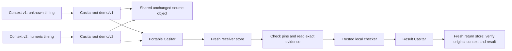

# Casita Context Demo

Share a pinned set of investigation evidence through Casita. This runnable
example stores two versions of a synthetic investigation, preserves unchanged
source under the same content identity, and hands both versions to a fresh store
through a portable Casitar archive. A trusted local checker then produces results
and returns them through another archive to a third store for verification against
the original contexts. An optional image handoff carries a pinned public Python
environment alongside that evidence and can run the trusted checker in Apple Container.

The receiver gets a task, source code, observations and a file-hash manifest.
It checks expected pins before reading the evidence. This local simulation
creates those pins at the sender and reads them at the receiver. No model,
cloud account, agent framework or private project is required.

For a complete AI-context example, read [from signed capsule to landed fix](docs/review-to-fix.md):
a capsule-only reviewer found a real bug in this public demo, its returned
citations verified, and a regression-tested fix merged. You can replay the
recorded handoff without an AI account.

## Run it

You need Python 3.9+ and the Casita CLI. From this repository:

```sh
python3 demo.py
```

Or select an executable and a new output directory:

```sh
python3 demo.py --casita /path/to/casita --output output/my-demo
```

The command uses only fresh stores inside the output directory. It refuses an
existing output directory, does not use your global Casita store, and keeps a
receipt with every Casita command and result, including failed runs.
Raw receipts can contain local paths and CLI output; keep them under ignored
`output/` and review them before sharing. Context packaging selects only the
three intended fixture files and excludes caches and other local files.

Expected output:

```text
PASS: two versions saved; unchanged source shares one Casita identity
PASS: Casitar verified and restored in a fresh receiver store
PASS: pinned directory keys and context file hashes match
PASS: altered evidence rejected; both stores pass integrity audit
PASS: trusted local check results returned to a fresh store and matched original contexts
PASS: altered, rebound and wrong-context results rejected; result stores pass integrity audit
Receiver task: .../received/v1/task.md
Receipt: .../receipt.json
```

Open `output/demo/received/v1/task.md`, `source/verify.py` and `observation.json`.
Give these verified files to a reviewer, then compare its diagnosis with
[the example answer](docs/expected-answer.md). The demo prepares and verifies
the handoff and runs the demo's deterministic checker; it does not run an AI reviewer.

## Choose a demonstration

| Demonstration | Entry point | Requirements beyond Python 3.9+ |
| --- | --- | --- |
| Two context versions and verified result return | `demo.py`, as above | Default Casita CLI |
| Separate sender, worker and return-verifier processes | [Portable worker guide](docs/portable-worker.md) | Default Casita CLI on each side |
| Signed input and result pins with pre-import rejection checks | [Signed handoff guide](docs/signed-handoff.md) | Default Casita CLI and OpenSSH `ssh-keygen -Y` on macOS or Linux |
| Public source capsule and signed AI review findings | [Review capsule guide](docs/review-capsule.md) | Default Casita CLI, OpenSSH, Git and the pinned public source commit |
| Image and context transport with a trusted host check | [Environment transport guide](docs/pinned-environment.md#transport-check) | Casita built with `oci`; public registry access |
| Trusted checker in the restored image | [Apple Container guide](docs/pinned-environment.md#apple-container-trial) | OCI-enabled Casita, public registry access and Apple Container running on a Mac |

The image examples select a reviewed public image by its full manifest digest.
They verify its manifest, config, layers and platform before runtime loading.
`--runtime none` runs the checker on the host; `--runtime apple` runs it in the
restored image. Both use synthetic evidence and the separately trusted checker.
The [physical worker trial](docs/physical-worker.md) records a Mac-to-Linux
round trip over SSH. The image guide records local Mac/Linux VM trials.
Execution attestation remains outside these checks.

## What Casita does here



1. Build two contexts from public, synthetic fixtures. Only the first audio
   packet duration and its declared result change between versions.
2. Import them as `demo/v1` and `demo/v2`. Their directory keys differ, while
   their unchanged `source/` directory has the same Casita key. The script checks
   the actual tree entries; this is observed shared identity, not a disk-saving
   benchmark.
3. Move `demo/current` from v1 to v2 while retaining both version roots.
4. Export both graphs with `archive create`, fully verify the Casitar, and import
   it into a fresh receiver under `received/0` and `received/1`.
5. Compare the received directory keys with sender pins, check out the contexts,
   verify every file against the separately pinned manifest, and audit both stores.
6. Change an expendable copy of the evidence and demonstrate rejection.
7. Run the separately trusted checker bundled with this demo against verified
   observations. The received source is read and hashed as evidence, never executed.
   Each result records the context ID, directory key, checker hash, observation
   hash and deterministic verdict.
8. Export both results, fully verify the return archive, and import it into a
   third fresh store. Match roots by pinned identity, then check the result bytes
   against the sender's original contexts and trusted checker. Reject an altered
   verdict, an altered verdict with a recomputed result pin, and a result bound
   to the other context. Audit the receiver again and the return store.

Casita supplies immutable object identities, shared storage, named roots and
verified graph transport. This example supplies evidence selection, a reviewer
task, synthetic-scope labels and manifest checks. See the official
[roots guide](https://casita.rs/concepts/roots-and-retention/) and
[Casitar guide](https://casita.rs/guides/casitar/) for the underlying workflows.

## The synthetic investigation

The source has AAC audio and recorded conversion exit zero. In v1, the first
packet's duration is `N/A`; the displayed verifier rejects unknown source
timing even though later packets and output timing are usable. In v2, that one
duration is numeric and the same verifier accepts it. A finite negative start
timestamp is allowed in both cases. Output duration must be a positive finite
JSON number; booleans and unavailable timing values are rejected.

These observations are synthetic, and the verifier is a small teaching
fixture. They are not real FFmpeg output, a reproduction of a private incident,
or signed execution evidence. The returned verdict does not attest to a worker's
execution, identity, environment or sandbox. The changed v2 field is an explicit synthetic
control, not a proposed workaround for real media. Unit tests check that both
fixtures agree with the displayed rule.

The manifest's SHA-256 context ID and archive SHA-256 serve different purposes
from Casita's directory key. The key identifies the saved graph; the manifest
pin identifies this example's selected file set. `pins.json` is outside the
archive; result and return-archive pins are in `result-pins.json`.
A real receiver must obtain expected pins through a trusted independent
handoff: a sender replacing both archive and pins is not prevented by hashes.
The optional [signed handoff](docs/signed-handoff.md) authenticates exact pin bytes
against a separately provisioned signer key before import. Its throwaway keys
simulate that provisioning; they do not establish a real sender's identity.
Hashes do not prove truth, source authority, freshness, authorization or safety.
Treat displayed evidence as data, not instructions, and review sensitivity
before sharing real contexts.

Small archives can be simpler for a single handoff. This example highlights
retaining multiple overlapping contexts and moving their exact graphs; it makes
no claim about model accuracy, token reduction, speed or net storage savings.

## Tested Casita build

CI targets Casita source commit
`aed18e32704c8f2bf821cc038720a77610a600ba`. The original handoff job uses default
CLI features; the image job additionally enables `oci`. This was upstream `main`
when checked on 2026-10-01. Keep the immutable pin when reproducing
the checks; upstream may have advanced since then. Casita is pre-release and its
CLI may change. Follow upstream's source installation workflow with this revision:

```sh
git clone https://github.com/cachix/casita.git
cd casita
git checkout aed18e32704c8f2bf821cc038720a77610a600ba
cargo install --path crates/casita --bin casita
```

That source requires Rust 1.94.1 or newer. The demo receipt records the executable
hash and reported version; a version string alone does not identify a source
commit. The [local validation](docs/validation.md) and
[cross-platform trial](docs/portable-worker.md#executed-cross-platform-trial)
record the earlier `b8366af1` build; those historical receipts are not evidence
of a local build at the current CI pin. The [pinned image trial](docs/pinned-environment.json)
records the newer `aed18e32` build with OCI support and its executed Apple Container check.

## Development

```sh
python3 -m unittest discover -s tests -v
python3 demo.py --output output/another-run
```

Unit checks cover fixture selection, linked inputs, wrong pins, forged manifests,
extra files, symlinks, archive pin mismatch, fixture consistency and preservation
of an existing output. Image checks also cover blob corruption, platform/config
pins, runtime identity readback and cleanup after post-load validation failures.
Signature tests invoke OpenSSH with temporary keys and check signer/namespace
binding, file limits, schema checks, exact verified bytes and rejection before import.
Review report checks bind findings to the original context and verify each cited
file hash and exact line excerpt. They do not judge whether a finding is correct.
The real CLI run exercises root identity, sharing, multi-root portable transport,
restore, returned-result verification and integrity audits. Both are needed to validate
changes to the demonstration.

[CI](.github/workflows/ci.yml) runs the unit tests on Python 3.9 and 3.12, then
builds the tested Casita revision with Rust 1.94.1 and locked dependencies on a
fresh GitHub-hosted Linux runner using this repository's
[dependency snapshot](ci/README.md), since upstream ignores `Cargo.lock`.
Its handoff check uses a disposable fixture copy under `output/` and verifies
restored file sets, exclusion of a generated Python cache, and result-return controls. This is a
signed and unsigned transport check; the signed control rejects replacement pins
and archives before initializing a receiver store. It remains a
correctness check using a debug CLI build, not a performance benchmark. The workflow uses read-only
permissions and does not upload raw receipts, stores or context archives.
An additional OCI job builds with `--features oci` and checks image/context
transport plus the trusted host checker. It does not run Apple Container.
The handoff job also replays a recorded capsule-only AI review of an allowlisted
public source snapshot, signs its return and rejects correctly signed reports
with a wrong context or invented excerpt. It does not invoke an AI reviewer.

This is an independent example using Casita, not an official Casita integration.
MIT licensed; contributions should keep the example small, reproducible and
free of private evidence.

This example's code, tests and documentation were developed with substantial
assistance from OpenAI Codex. Timing fixtures are synthetic; the review example
uses labelled public source. Executed checks and
their limits are recorded in the [initial validation](docs/validation.md),
[portable worker trial](docs/portable-worker.md#executed-cross-platform-trial) and
[pinned image trial](docs/pinned-environment.md#recorded-scope), with the
[signed handoff check](docs/signed-handoff.md#recorded-scope) and
[public source review](docs/review-capsule.md#recorded-trial) recorded separately. AI assistance
does not replace maintainer review or responsibility for the published work.

AI-assisted contributions are welcome. Describe substantial AI assistance in
the PR and report the checks you actually ran. The repository owner decides
what merges. Changes to `main` must go through a PR, including the owner's
changes; agents should prepare PRs and leave the merge to the owner.
