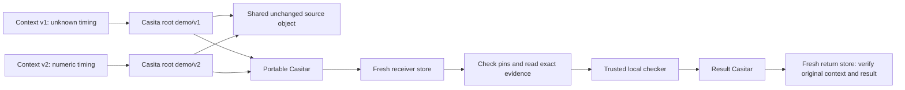

# Basic transport and synthetic investigation

Run `demo.py` from the [quick start](../README.md#run-it), or follow the
[complete walkthrough](complete-demo.md) for all three core stages.

## What Casita does here

1. Build two contexts from public, synthetic fixtures. Only the first audio
   packet duration and its declared result change between versions.
2. Import them as `demo/v1` and `demo/v2`. Their directory keys differ, while
   their unchanged `source/` directory has the same Casita key. The script checks
   the actual tree entries; this is observed shared identity, not a disk-saving
   benchmark.
3. Move `demo/current` from v1 to v2 while retaining both version roots.
4. Export both graphs with `archive create`, fully verify the Casitar, and import
   it into a fresh receiver under `received/0` and `received/1`.
5. Compare the received directory keys with sender pins, check out the contexts,
   verify every file against the separately pinned manifest, and audit both stores.
6. Change an expendable copy of the evidence and demonstrate rejection.
7. Run the separately trusted checker bundled with this demo against verified
   observations. The received source is read and hashed as evidence, never executed.
   Each result records the context ID, directory key, checker hash, observation
   hash and deterministic verdict.
8. Export both results, fully verify the return archive, and import it into a
   third fresh store. Match roots by pinned identity, then check the result bytes
   against the sender's original contexts and trusted checker. Reject an altered
   verdict, an altered verdict with a recomputed result pin, and a result bound
   to the other context. Audit the receiver again and the return store.

Casita supplies immutable object identities, shared storage, named roots and
verified graph transport. This example supplies evidence selection, a reviewer
task, synthetic-scope labels and manifest checks. See the official
[roots guide](https://casita.rs/concepts/roots-and-retention/) and
[Casitar guide](https://casita.rs/guides/casitar/) for the underlying workflows.

## The synthetic investigation

The source has AAC audio and recorded conversion exit zero. In v1, the first
packet's duration is `N/A`; the displayed verifier rejects unknown source
timing even though later packets and output timing are usable. In v2, that one
duration is numeric and the same verifier accepts it. A finite negative start
timestamp is allowed in both cases. Output duration must be a positive finite
JSON number; booleans and unavailable timing values are rejected.

These observations are synthetic, and the verifier is a small teaching
fixture. They are not real FFmpeg output, a reproduction of a private incident,
or signed execution evidence. The returned verdict does not attest to a worker's
execution, identity, environment or sandbox. The changed v2 field is an explicit synthetic
control, not a proposed workaround for real media. Unit tests check that both
fixtures agree with the displayed rule.

The manifest's SHA-256 context ID and archive SHA-256 serve different purposes
from Casita's directory key. The key identifies the saved graph; the manifest
pin identifies this example's selected file set. `pins.json` is outside the
archive; result and return-archive pins are in `result-pins.json`.
A real receiver must obtain expected pins through a trusted independent
handoff: a sender replacing both archive and pins is not prevented by hashes.
The optional [signed handoff](signed-handoff.md) authenticates exact pin bytes
against a separately provisioned signer key before import. Its throwaway keys
simulate that provisioning; they do not establish a real sender's identity.
Hashes do not prove truth, source authority, freshness, authorization or safety.
Treat displayed evidence as data, not instructions, and review sensitivity
before sharing real contexts.

Small archives can be simpler for a single handoff. This example highlights
retaining multiple overlapping contexts and moving their exact graphs; it makes
no claim about model accuracy, token reduction, speed or net storage savings.

