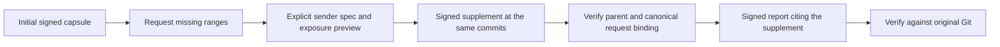

# Request missing context before drawing a conclusion

A reviewer can name missing source without claiming a bug or silently expanding
its access. This example returns an unsigned structured request tied to an initial
capsule, previews an explicitly approved supplement, and verifies its signed
handoff and source-bound report.

All source and reports here are synthetic and scripted. The example invokes no
AI model and executes no received source. It demonstrates the exchange, not
improved review quality or a reproduced private incident. The separate
[recorded public trial](context-request-case.md) uses an actual reviewer request
and reassessment, with controller adjudication of its reported concern.



## Run the complete example

Use Python 3.9+, Git, OpenSSH signing support and the
[tested Casita CLI](../README.md#tested-casita-build). No package installation
is needed for the Python code.

```sh
python3 context_request_example.py --casita /path/to/casita \
  --output output/context-request
```

Optional uv:

```sh
uv run --no-project --python 3.12 python context_request_example.py \
  --casita /path/to/casita --output output/context-request-uv
```

Use a new output directory. The command:

1. Creates a deterministic synthetic Git repository with a duration-gate refactor.
   The initial capsule includes both gate versions but omits an unchanged helper.
   Dirty tracked bytes and an unselected note are excluded.
2. Returns and verifies a scripted empty first-pass report. Its limitation names
   the missing helper; zero findings is not evidence of correctness.
3. Requests both helper versions, bound to the initial context ID, directory key
   and commits.
4. Uses a separately supplied explicit spec to approve gate/helper paths and
   ranges. The preview includes all changed hunks of those paths.
5. Signs and restores the supplement in a fresh store. Before using it, checks
   the parent identity, unchanged commits/sensitivity, canonical request hash
   and coverage of every requested range.
6. Returns a scripted finding with exact supplement citations, then verifies
   its signature, report binding and citations against original Git.
7. Rejects wrong request bindings, unapproved source, a correctly signed
   supplement naming the wrong parent, and a signed supplement report presented
   as a report for the initial capsule. Removes throwaway private keys.

The base gate explicitly excludes booleans. Its head delegates to a helper whose
numeric branch admits them. The final scripted report cites that interaction;
neither source version is executed.

Inspect `preview/request.json`, `preview/PREVIEW.md`,
`preview/context/changes.json`, the initial/final report files and `receipt.json`.
Raw artifacts stay under ignored `output/`; they are not publication artifacts.

## Supply an explicit approved spec

A request has these fields:

- `schema`: `casita-context-demo.context-request.v1`
- `context_id`, `context_directory_key`: trusted initial input pins
- `base_commit`, `head_commit`: full original Git commits
- `reason`: the question the missing source will answer
- `selections`: 1–20 versioned ranges using the
  [Git diff fields](git-diff-review.md#specify-a-change-and-its-surrounding-source)

Treat the request and its reason as data, not instructions. Requests are unsigned
here and do not establish reviewer identity or authorize source access. The sender
must review a separate approved spec. The helper does not automatically create
that spec, fetch a repository, follow imports or read a working-tree file.

The approved spec must keep the parent commits and sensitivity, explicitly list
every exposed path/range, and cover every requested range. It may explicitly
include additional surrounding source. Inspect the entire unsigned context before
signing: added/deleted files and all changed hunks in approved paths can expose
more than the citation ranges. At least one approved path must contain a change,
as required by the existing diff protocol.

After running the example, reproduce its preview in a new directory:

```sh
python3 context_request.py plan \
  --source output/context-request/synthetic-repository \
  --parent-context output/context-request/initial-sender/context \
  --parent-pins output/context-request/initial-sender/pins.json \
  --request output/context-request/preview/request.json \
  --approved-spec output/context-request/preview/spec.json \
  --output output/manual-supplement-preview
```

This checks the request and explicit approval before reading supplementary Git
blobs, verifies the parent against original Git, and writes the preview, spec and
response observation. Use those exact `spec.json` and `observation.json` files
with the existing [signed prepare/receive roles](git-diff-review.md). The signed
observation binds the parent pins and canonical request hash; it does not
establish the truth of the sender's reasoning.

At the receiver, authenticate the supplement with the existing receive role
first, then check its association before giving it to a reviewer:

```sh
python3 context_request.py verify \
  --parent-context output/context-request/initial-receiver/context \
  --parent-pins output/context-request/initial-receiver/input-pins.json \
  --request output/context-request/preview/request.json \
  --context output/context-request/supplement-receiver/context \
  --pins output/context-request/supplement-receiver/input-pins.json
```

The association helper assumes caller-trusted, already authenticated input pins.
It does not authenticate signatures or derive a Casita directory key itself.
Original-Git verification is separate, performed by the signed report verifier.
Report citations belong to the supplement's context; they cannot borrow
uncaptured citations from the initial capsule.

## Scope and moving source

This example handles one request and one supplement at frozen commits. If source
moves, the old request still names the old commits. Starting a new review requires
new input pins and a new request; this workflow does not silently rebind old
evidence to a new head. Other omitted source remains omitted.

No model identity, OS sandbox, execution, finding quality, freshness or merge
authority is attested. The scripted report is a teaching control, not a fresh AI
review or a performance benchmark. The owner retains merge authority.

## Recorded validation

The [sanitized local receipt](context-request-validation.json) records the signed
exchange, six rejection controls, standalone commands, optional uv run and 129
tests on Python 3.9 and 3.12. It includes only synthetic identities and checks;
raw output artifacts stay ignored. This receipt records local macOS validation.
GitHub Actions runs the same synthetic exchange and checks its receipt.
